## Solace MQTT IoT Device SDK for the L-Spark Secure IoT Accelerator

The Secure IoT Accelerator program is intended to enable Canadian Internet of Things (IoT) ventures by providing them with global market reach capability with a Secure by Design technology.

For more information about the accelerator program, visit: https://www.l-spark.com/press-release/l-spark-telus-blackberry-and-solace-launch-accelerator-for-emerging-canadian-iot-ventures/

Youtube: https://www.youtube.com/watch?v=ZL2ADLHl-XQ&feature=youtu.be

The Solace MQTT IoT SDK provides secure MQTT connectivity on the IoT Accelerator Device Platform. It includes an example on how to utilise the Telus SIM Secure Storage element to establish a TLS connection to Solace Cloud.

It is based on [aws-iot Embedded C Device SDK](https://github.com/aws/aws-iot-device-sdk-embedded-C/) and includes the following modifications:

* Removed AWS IoT Hub specific features - Device Shadow, Jobs
* Removed samples, tests
* Added mbedTLS source code, v [2.17](https://github.com/ARMmbed/mbedtls/tree/mbedtls-2.17)
* Added support to pass in Root CA,Device Certificate and Device Key to the library rather than reading from files
* Added example of how to access the Telus Secure Storage to read certificates and keys and pass these into the MQTT client library to establish a TLS connection

Changes have been added to the master branch of this repository.

Find a getting started tutorial below, the original release branch [readme.md](https://github.com/aws/aws-iot-device-sdk-embedded-C/blob/release/README.md) applies. 

## Overview
* Prerequisites
  * Set up the hardware and modem connectivity 
  * Obtain the Telus Modem / Secure Storage API  
  * Optional - Apply BlackBerry security patch to Raspbian
  * Optional - provision certificates and keys onto the secure storage
* Set up a development environment:
  * Develop direct on Raspberry PI / device (not documented in this readme)
  * Eclipse on MacOs or Windows
* SDK and sample application installation
* Solace Cloud Access and Connectivity
* Run sample application

## Prerequisites
### Set up the hardware and modem connectivity
See this [tutorial](https://github.com/TELUS-Emerging-IoT/TELUS-Devkit-Hardware-Tutorial/blob/master/README.md)

### Obtain Telus Modem / SCC Toolkit API
The library is provided in a ZIP file, unzip and change into the directory where you unzipped the contents.
Then copy SCC Toolkit library components to the Raspberry PI via SCP.
Headers from folder `inc` to `/usr/include` on the raspberry pi, `libscc-toolkit.so` and `libscc-toolkit.a` to `/usr/lib` on the Raspberry PI.

### Optional - Apply BlackBerry security patch to Raspbian
TBC - add link

### Optional - provision certificates and keys onto the secure storage
The repository contains a sample application () that uploads files to the secure storage.
Participants wil be either provided with a pre-configured SIM or will be supplied with the device certificate, key and Digicert Rooot CA Certificate for Solace Cloud.

## Development directly on Device
Source code is provided as is with a sample make file. No further instrucitons are available at this point.

## Set up Eclipse Development Environment
### Install Eclipse for C/CPP
Download and install Eclipse [IDE for C/C++ Developers](https://www.eclipse.org/downloads/packages/release/2019-03/r/eclipse-ide-cc-developers) for your platform.

### Obtain and install Raspberry Pi Tool Chain
Tool chains for different platforms are available:
* Windows: http://gnutoolchains.com/raspberry/
* MacOS (verified during SDK adaption): download [ZIP](https://github.com/yc2986/armv8-rpi3-linux-gnueabihf-gcc-8.1.0-macos-high-sierra/archive/master.zip), also see [github](https://github.com/yc2986/armv8-rpi3-linux-gnueabihf-gcc-8.1.0-macos-high-sierra) and [documentation](https://medium.com/coinmonks/setup-gcc-8-1-cross-compiler-toolchain-for-raspberry-pi-3-on-macos-high-sierra-cb3fc8b6443e).
* Linux: https://github.com/raspberrypi/tools/tree/master/arm-bcm2708

Instructions on setting up a cross compile tool chain for RaspBerry PI in Eclipse - (https://dontpressthat.wordpress.com/2017/11/15/using-eclipse-to-write-c-c-programs-for-the-raspberrypi/)


### Set up remote debugging using GDB

Eclipse includes support to create remote debug configurations that execute applications via SSH and GDB on a target system. This requires GDB server to run on the Raspberry PI.
Install gdbserver on Raspberry PI, execute the following commands on the Raspberry PI:

```
$ sudo apt-get install gdbserver

$ gdbserver --multi 192.168.0.131:2345
```

(http://geomodule.com/sw-eng-notes/2017/03/25/raspberry-pi-debugging-with-gdb-command-line/)

### Import required libraries from Raspberry PI

In order to compile code that relies on libraries installed on the Raspberry PI these need to be added to the Tool Chain.
The basic process is explained here: (https://raspberry-projects.com/pi/programming-in-c/compilers-and-ides/eclipse/adding-libraries-to-eclipse-for-windows)

The sample application requires Wiring PI to interact with the shield's user button and LED.
Add the header files and libraries to the toolchain as described above, obtain these from the raspberry PI via SCP:
```
$ scp {user}@{host or ip}:/usr/lib/libwiringPi* {local toolchain sysroot/usr/lib directory}
$ scp {user}@{host or ip}:/usr/include/wiringPi* {local toolchain sysroot/usr/include directory}
```

The SCC Toolkit requires libpcsclite, as above please obtian these files via SCP:
```
$ scp {user}@{host or ip}:/usr/lib/arm-linux-gnueabihf/libpcsclite.* {local toolchain sysroot/usr/lib directory}

```
Copy SCC Toolkit library components to your `sysroot` directory, headers from folder `inc` to `sysroot/usr/include`, `libscc-toolkit.so` and `libscc-toolkit.a` to `sysroot/usr/lib`

## SDK and Sample Installation
This section explains the individual steps to retrieve the necessary SDK files and be able to build the sample application.

Steps:

 * Download the released ZIP from https://github.com/solace-iot-team/solace-iot-device-sdk-embedded-C/releases/tag/v.0.9.0  
 * Unzip the file to a new directory
 * Import application into Eclipse
 * Add the Secure Storage API source code - copy headers into `inc-gd` folder, code into `src-gd` folder.
 
### Import Project into Eclipse

Select import menu, then `From existing project folder` under `General` 
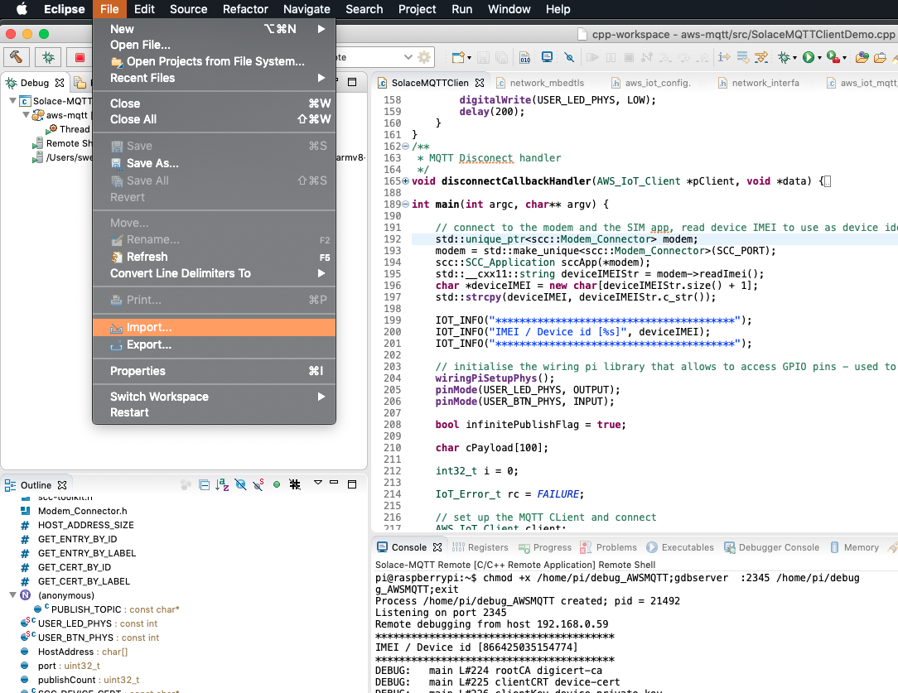
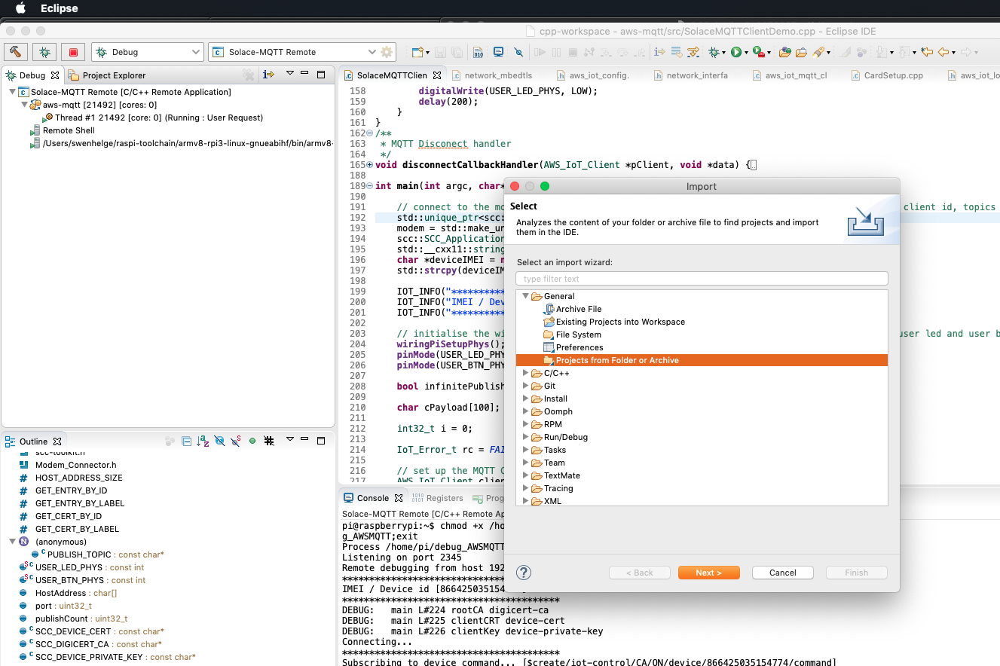
Locate the folder where you stored the source code, the project should be detected. Click `Finish`
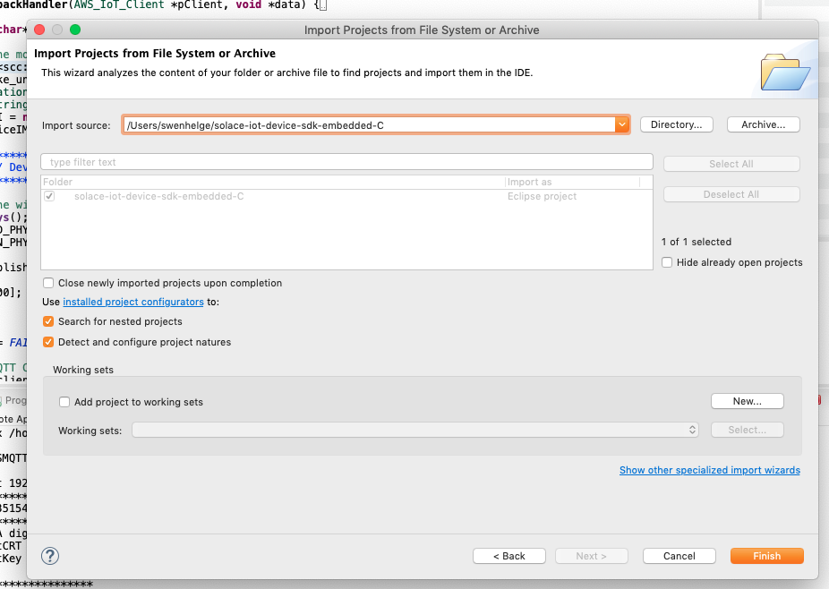

After importing adjust the location of your Raspberry PI toolchain, open project preferences and then adjust the path in the following two dialogs:
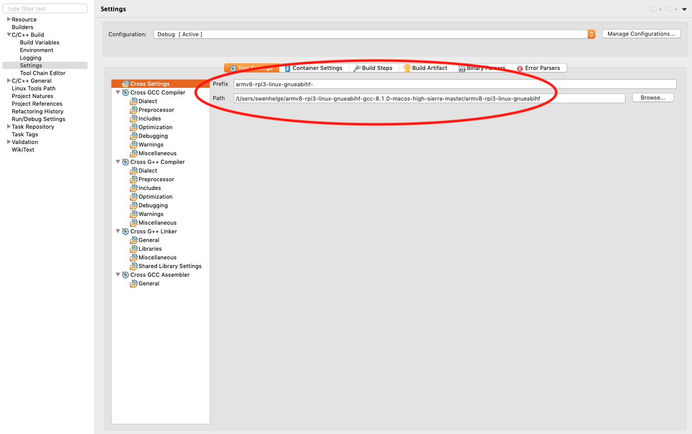
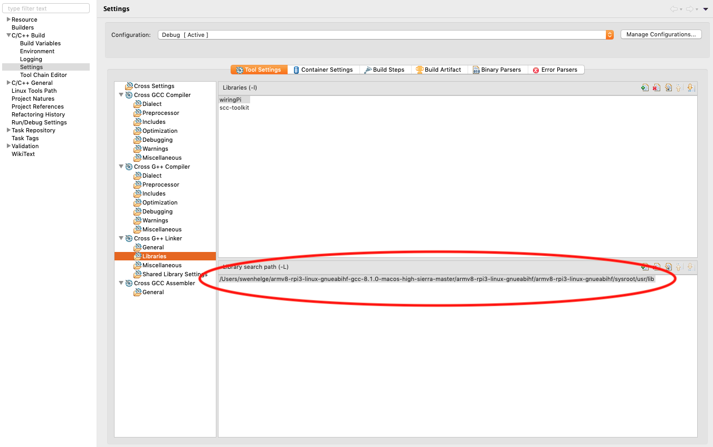


## Solace Cloud Access 7 Connectivity

### Login to Solace Cloud
Participants will receive an inivtation by email to join the Bootcamp Solace Cloud Account, login at (https://console.solace.cloud/)
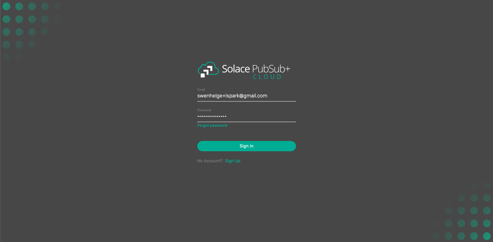
### Get Cloud Connection Parameters
(currently requires an Enterprise plan for mutual TLS authentication)
Locate the service
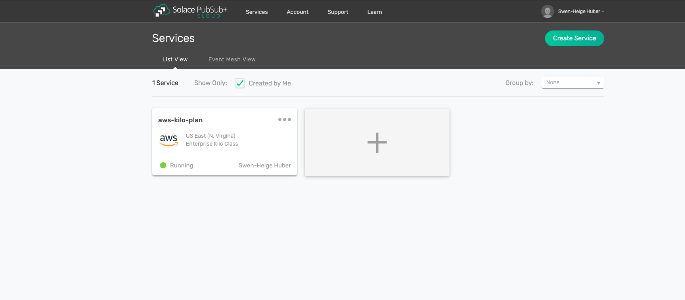
Select the service and switch to the `Connect` tab, expand the MQTT section and take note of the `Secured MQTT Host` URL:
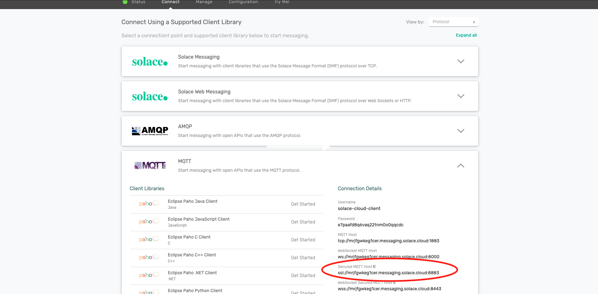

### Verify client username
Click the `Manage` menu and select `Access Control`
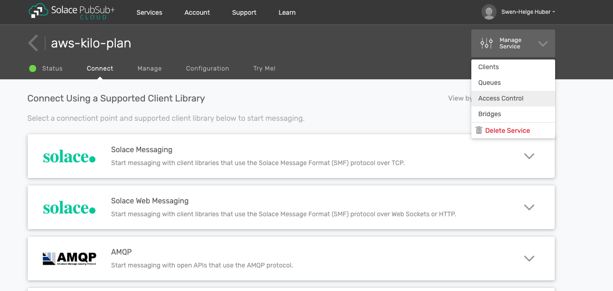

Switch to `Client Usernames` and verify your device identifier exists (in the bootcamp this should be your device IMEI)

## Running the sample application

### Setup Connectivity & Security
* Locate the file `aws_iot_config.h`
* Replace `AWS_IOT_MQTT_HOST`
* If you provisioned the certificates and key under different keys in the secure storage adjust AWS_IOT_ROOT_CA_FILENAME, AWS_IOT_CERTIFICATE_FILENAME, AWS_IOT_PRIVATE_KEY_FILENAME

```
// =================================================
#define AWS_IOT_MQTT_HOST              "mrjfgwkeg1cer.messaging.solace.cloud" ///< Customer specific MQTT HOST.
#define AWS_IOT_MQTT_PORT              8883 ///< default port for MQTT/S
#define AWS_IOT_MQTT_CLIENT_ID         "default" ///< MQTT client ID should be unique for every device
#define AWS_IOT_ROOT_CA_FILENAME       "digicert-ca" ///< Root CA file name
#define AWS_IOT_CERTIFICATE_FILENAME   "device-cert" ///< device signed certificate file name
#define AWS_IOT_PRIVATE_KEY_FILENAME   "device-private-key" ///< Device private key filename
```
### Create a remote debug configuration
In Eclipse add a new Debug Configuration:
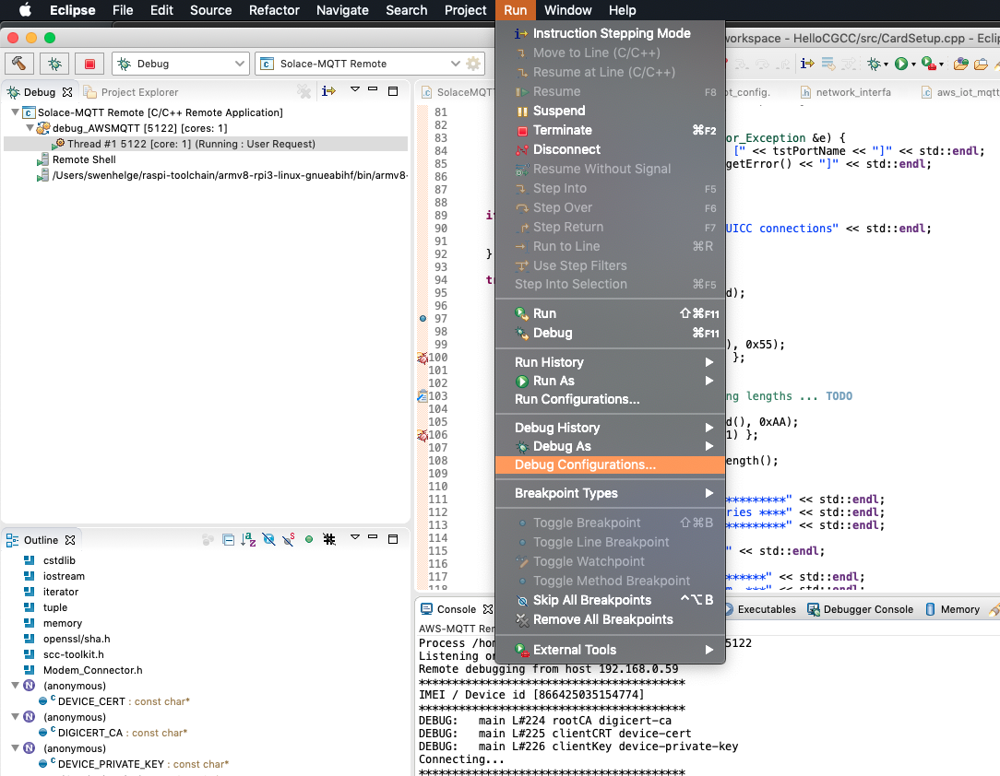
Select your application/project and set up the commands to send prior to running GDB
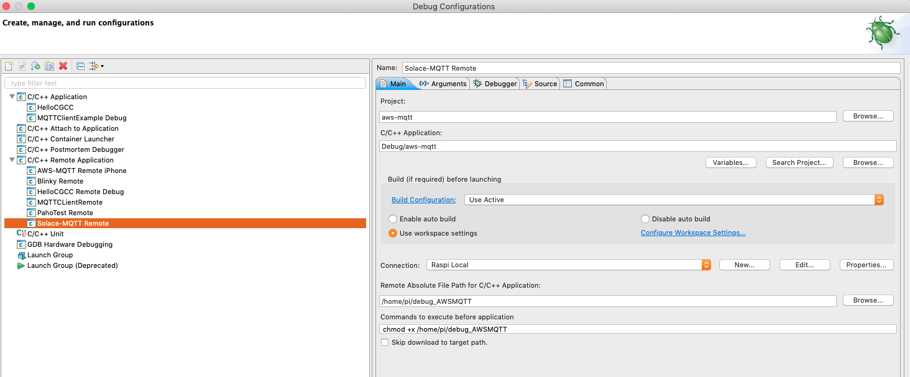
Set up the SSH connection to your raspberry PI
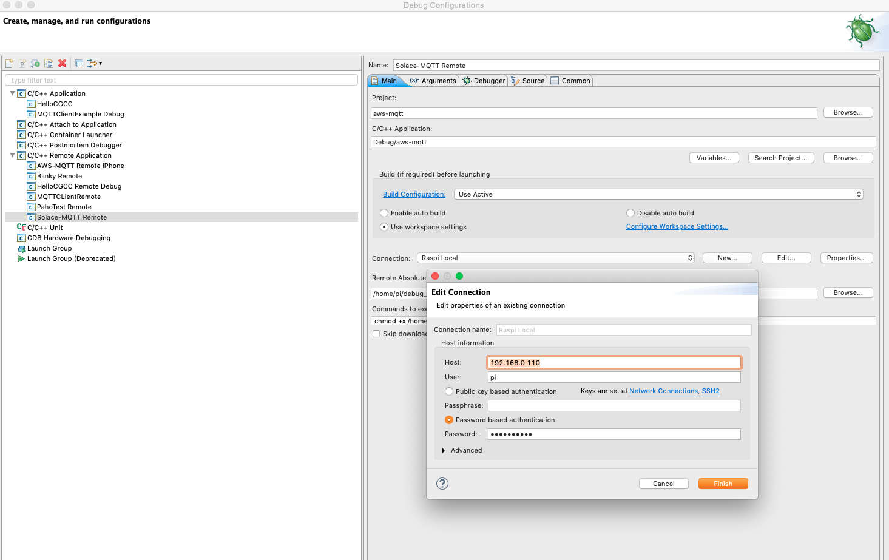

See section 4 here: (https://dontpressthat.wordpress.com/2017/11/15/using-eclipse-to-write-c-c-programs-for-the-raspberrypi/)

### Run
Start debugger
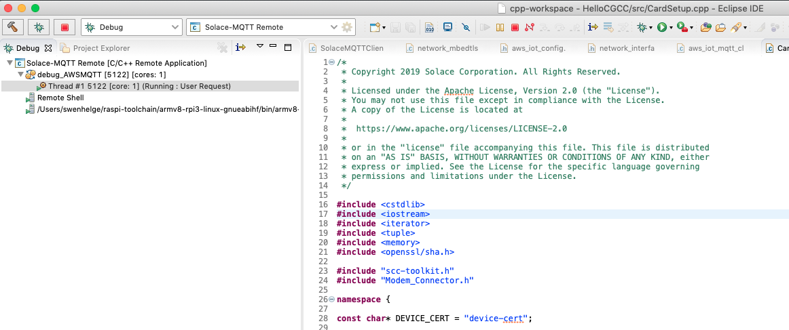

The application writes various information to the standard out, take note of the topics "Subscribing to device command" and  "Publishing to topic" as you need these to verify MQTT connectivity:
```
****************************************
IMEI / Device id [866425035154774]
****************************************
DEBUG:   main L#224 rootCA digicert-ca
DEBUG:   main L#225 clientCRT device-cert
DEBUG:   main L#226 clientKey device-private-key
Connecting...
****************************************
Subscribing to device command... [$create/iot-control/CA/ON/device/866425035154774/command]
Subscribing to regional command... [$create/iot-control/CA/ON/device/command]
Subscribing to national command ... [$create/iot-control/CA/device/command]
****************************************
****************************************
Publishing to topic [$create/iot-control/CA/ON/device/866425035154774/status]
****************************************
```

### Verify MQTT connectivity
* Outbound message from the device
* Inbound message to the device
#### Connect the Solace Cloud try-me console
* Go to the Solace Cloud Console
* Locate your service and open its page
* Select the `Try Me!` tab
* Set the `Publisher` topic on the left hand side to the value of `Subscribing to device command` noted above.
* Set the `Subscriber` topic on the right hand side to the value of `Publishing to topic`noted above
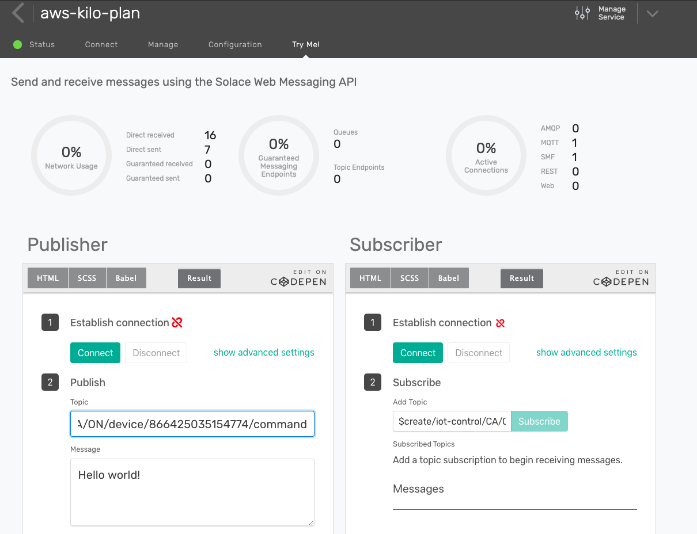
Then connect both Publisher and Subscriber using the `Connect` button. Also click the `Subsrcibe` button on the right hand side
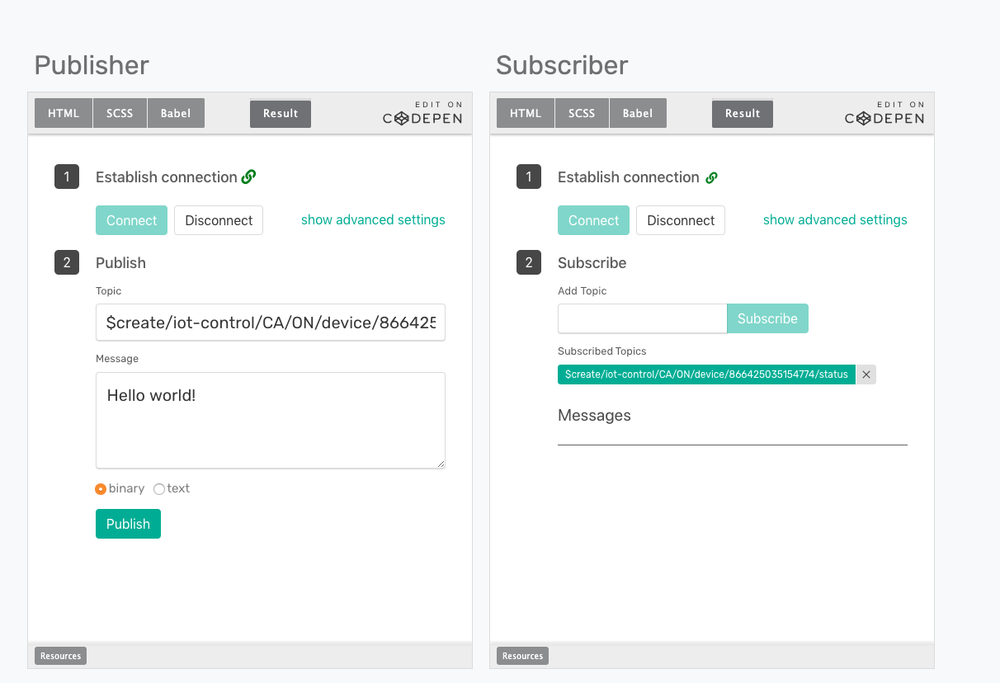

#### Locate the user programmable  button and LED
Schematic:

Photograph, look for label `user`:

#### Verify messages sent from device
* Press the user button
* Verify messages are received in the `Try Me!` console on the right hand side:
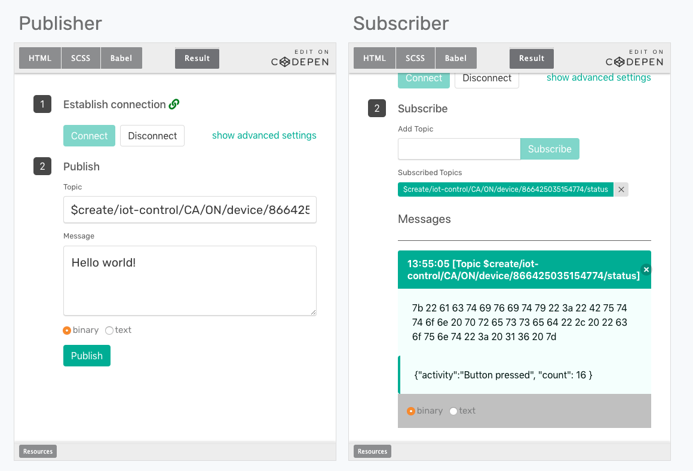

#### Verify messages are received by device
* Send a message from the `Try Me!` console: on the left hand side enter a message text and click `Publish`
s_verify_03_tryme_msg_sent
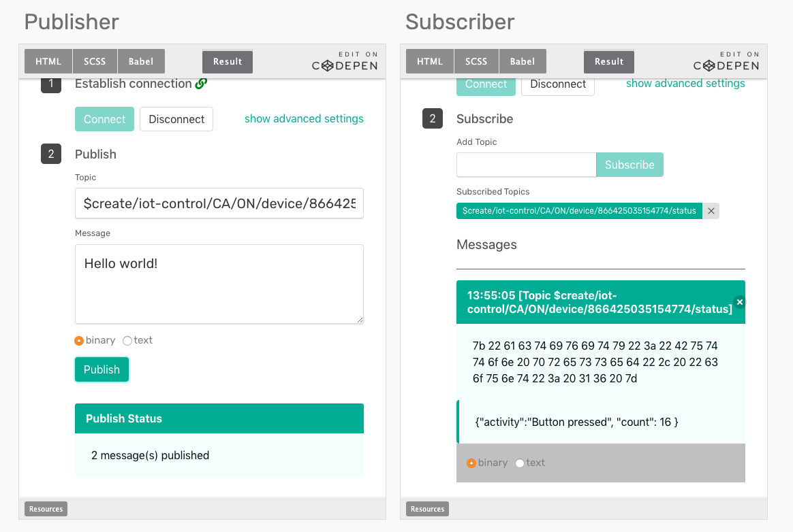

* Verify that user LED blinks three times
* Application logs the messages it receives to standard out:

```
$create/iot-control/CA/ON/device/866425035154774/command	Hello world!
Subscribe callback
$create/iot-control/CA/ON/device/866425035154774/command	Hello world!
```

## Resources
[API Documentation](http://aws-iot-device-sdk-embedded-c-docs.s3-website-us-east-1.amazonaws.com/index.html)

[MQTT 3.1.1 Spec](http://docs.oasis-open.org/mqtt/mqtt/v3.1.1/csprd02/mqtt-v3.1.1-csprd02.html)
