## Create and Prepare a Solace Cloud Service 

This document describes how to setup and prepare a Soalce Cloud Service for use with Client Certificate Authentication as used by the IoT Device SDK.

### Sign up for Solace Cloud

Use this URL to register. You will be entitled to start up a Developer Service Plan in a cloud and region of your choice:
(https://console.solace.cloud/login/new-account)

### Create a Solace Cloud Service

Once you have created and verified your account navigate to the "Messaging Services" view in the Solace Cloud Console.
Then click "Add Service".

Choose the developer plan, then select cloud and region, enter a service name of your choice: 

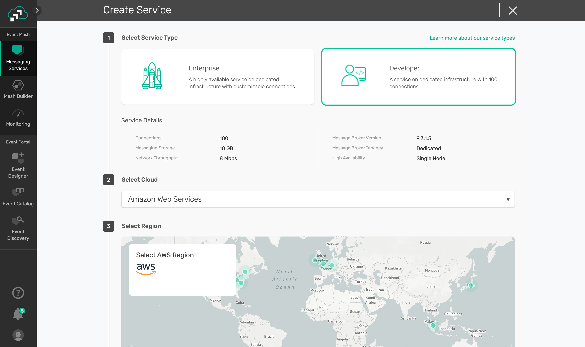
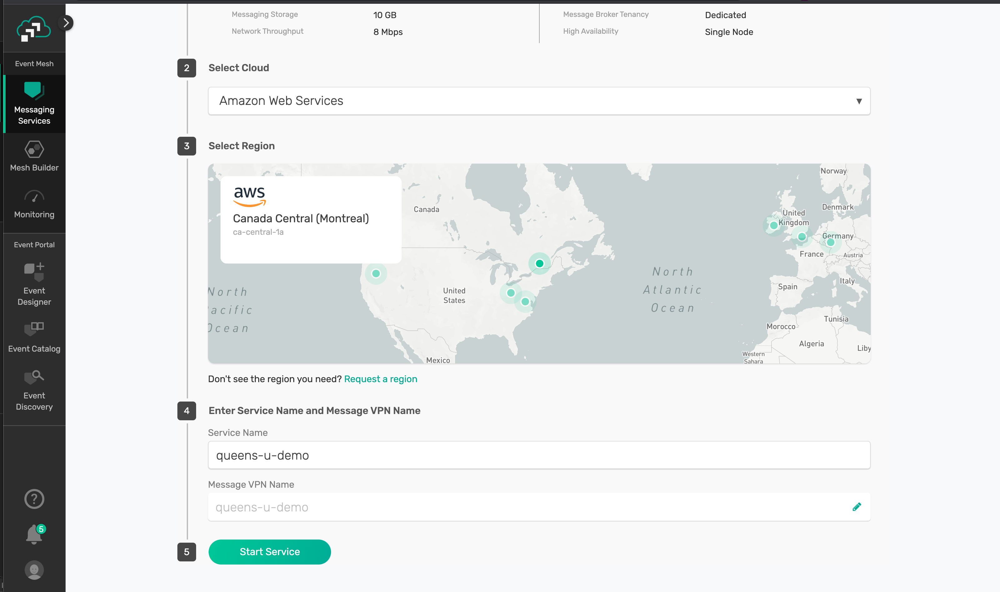

It will take a few minutes for your new service to start.

### Configure Authentication

Next you will need to set up your service for client certificate authentication:
* Enable client certificate authentication
* Upload the Root CA certificate [ca.pem](https://raw.githubusercontent.com/solace-iot-team/solace-iot-device-sdk-embedded-C/master/solace-setup/ca.pem)

Navigate to the "Manage" tab of the service you have created:
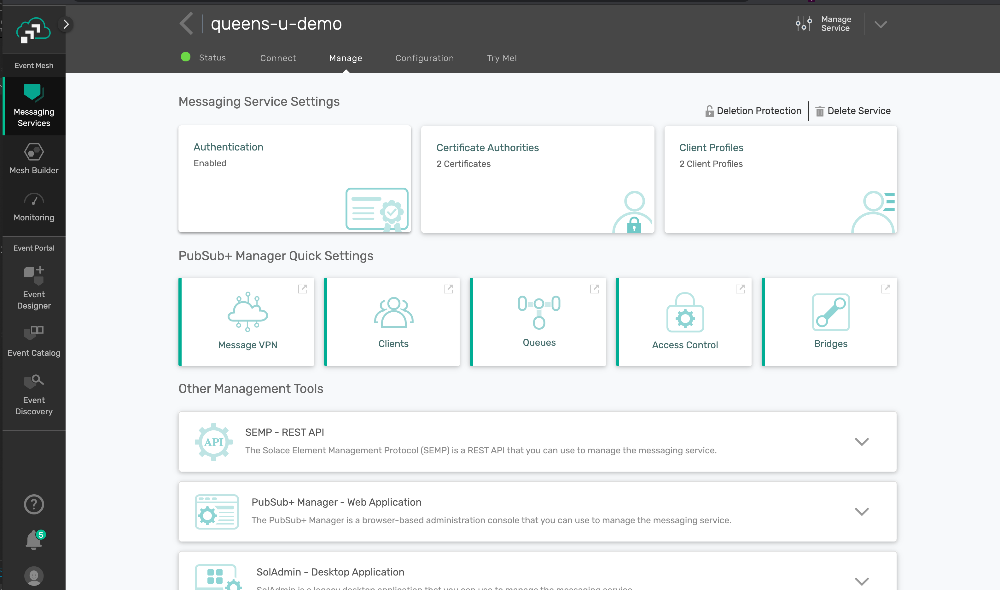

Then click "Authentication" - enable "Client Certificate Authentication", leave "Validate Certificate Dates" as disabled (the default) and save your changes: 
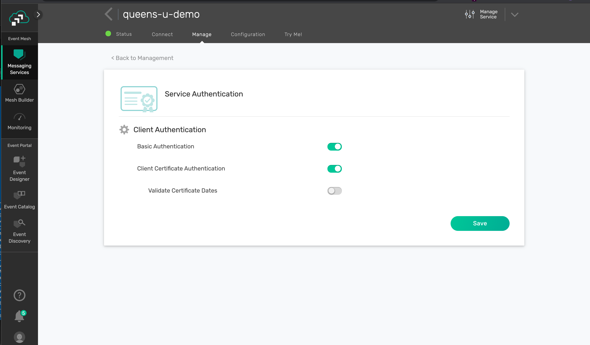

Then navigate back to the "Manage" tab main screen and click "Certificate Authorities". This is where you will add the new Root CA that you want to trust for authentication. 

Click "Add Certificate":
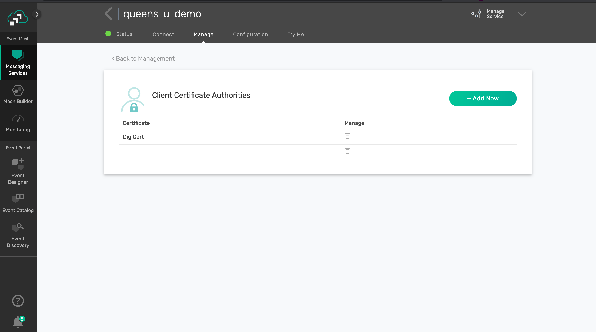
Provide a friendly name for your certificate and paste the contents of the [ca.pem](https://raw.githubusercontent.com/solace-iot-team/solace-iot-device-sdk-embedded-C/master/solace-setup/ca.pem) into the text box:
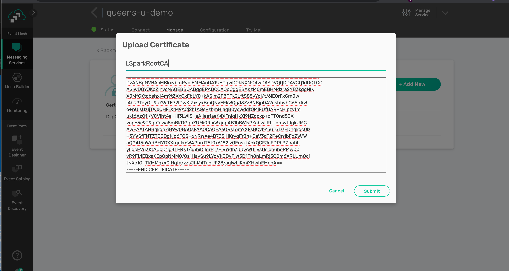
Your certificate was uploaded successfully:
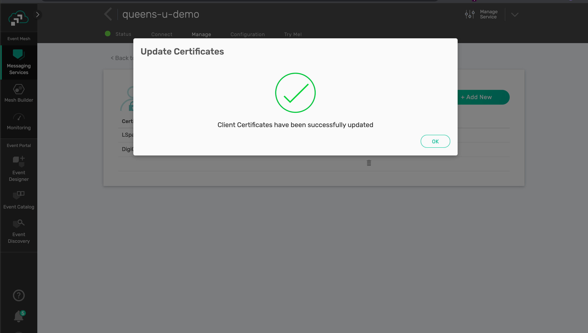
Your new certificate was added:
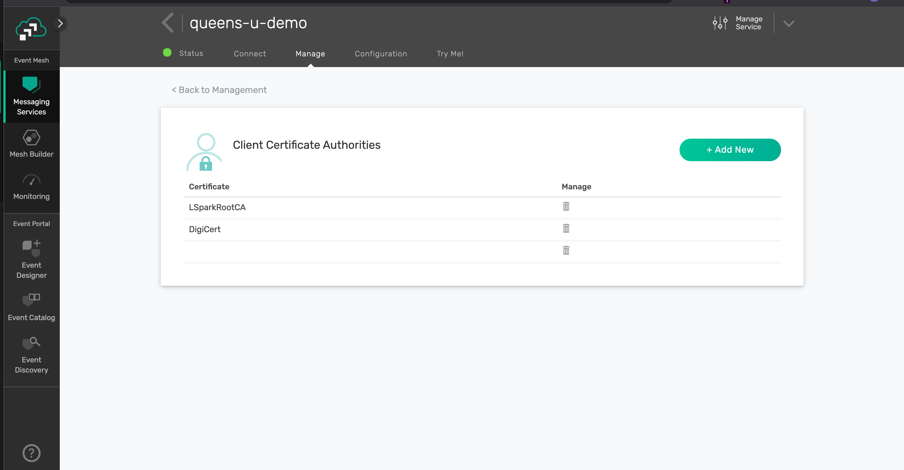

### Setup Client User Names for devices

Each device needs to be registered on the broker. In the L-Spark Secure IoT Accelerator we use the IMSI of the device/eSIM as the device id.
Please register all devices you want to grant access to the broker to.

Open the cloud service's "Management Console" - choos "Manage Service" and then the "Access Control" sub menu:
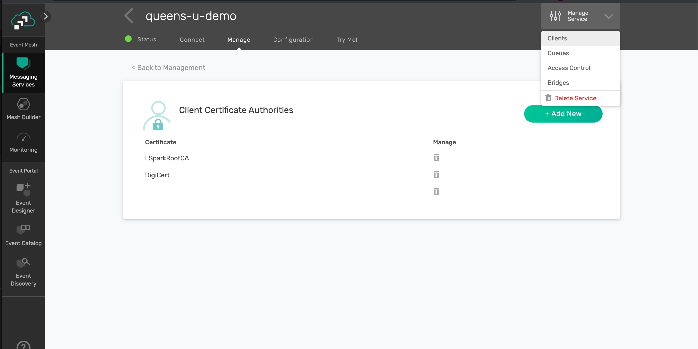

In the management console - switch to "Client Usernames", then click the add client username ("+ Client Username") button.
Enter your device IMSI as the client username, then click "Create":
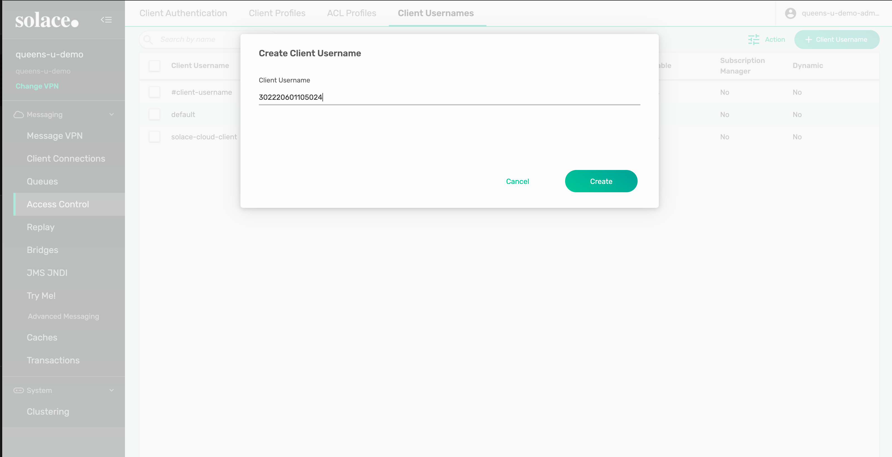
On the next screen accept the defaults and make sure the client username is enabled.
(Note - you could create dedicated client and ACL profiles for your devices to restrcit their access ot the broker and to topics on the broker)
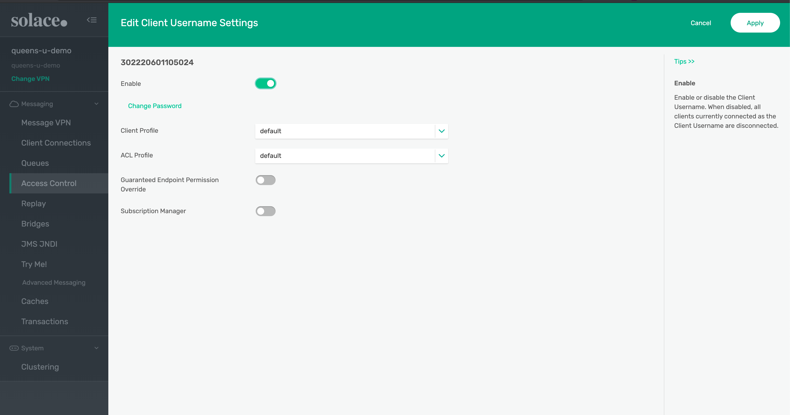

Review that your client username was created:

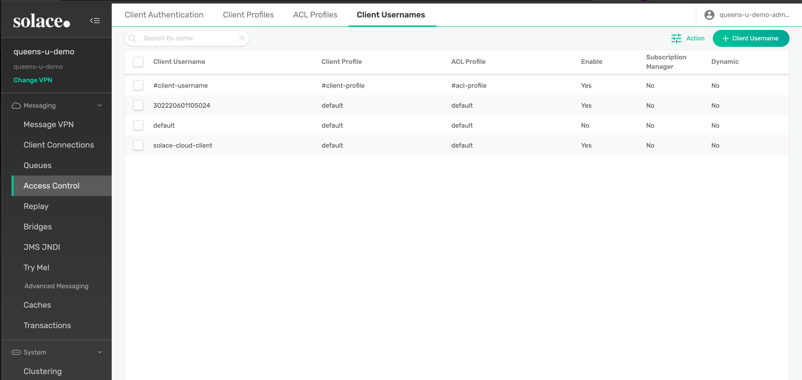

